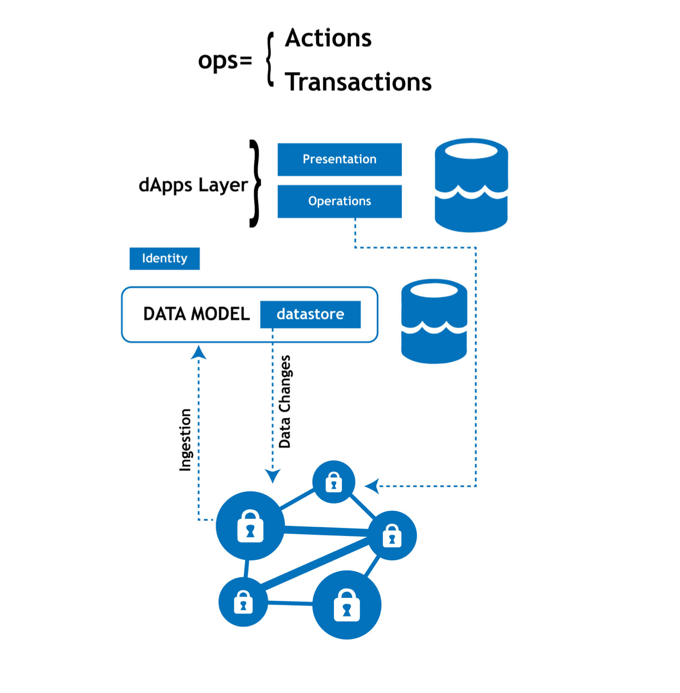

# Software Requirements

#### 1. Introduction

The rationale behind the dApps is to develop applications using the rock solid transaction capabilities, tamper proof immutability and the impenetrable security offered by the Peerplays blockchain platform.

While these are compelling reasons for developers to use blockchain technology, the need for end to end application development knowledge, traditional enterprise backed software development methods etc create entry barriers for developers.

A Blockchain Middleware System \(BMS\) platform with various components will be build by PBSA to address these unique challenges. Our goal is to expose general purpose APIs which can be accessed in a language and platform agnostic way and thus making it possible for developers of varying skill sets to create applications on the blockchain.

\*\*\*\*

#### 2. Identity management

User management and identity management is a major part in any application development and the blockchain with unique security constraints brings challenges to the same. While the public key cryptography based account access provided by the Peerplays blockchain is secure compared to a username password based authentication, the same makes it challenges and next to impossible for laymen to create and use dApps. A common alternative proposed is using cryptocurrency wallets. This doesn't really solve the on-boarding challenge as a tiny set of internet browsing population and cryptocurrency wallets.

To ensure faster and smoother on-boarding of users, Peerplays is thus creating an identity management and SSO platform which helps anyone with an email address, Facebook or Google account to easily create an account on the Peerplays blockchain. For tech-savvy users the traditional blockchain mechanism will be used to create the accounts.

In addition to the account creation, Peerplays will also provide simpler mechanisms for dApp developers to create and provision dApps and configure various dApp level permissions.

#### 3. Requirements

**3.1 High level Requirements**

This section will define each of the high level components of the the identify manager product - PeerID.

The components:

* account creation
* retrieving Peerplays keys
* dApp provisioning
* dApp Permissions
* unlinking third party services
* Multi Factor Authentication
* Anti Phishing features

**3.1.1 Account creation**

A dApp user account creation will always involve creation of an account on the Peerplays blockchain. PeerID will provide 2 modes of account creations. The first mode will be for advanced users which will use the core Peerplays Faucet to generate a blockchain account and keys. A simpler mechanism wherein the account can be created by signing up with Facebook, Google accounts. The list of third party services will be increased in the future and they might include Twitter, Discord, Steam, Snapchat etc.

**3.1.2 Retrieving Peerplays keys**

Scenarios might arise which may lead a user to request for the Peerplays private keys or master password. In such a scenario, requested keys or a MASTER Password will be send to the user via an email and shown on the screen/UI. This will be an irreversible action and all the third party links established during this process will get secure deleted from the PeerID databases.

**3.1.3 dApp Provisioning**

Developers must be given a simpler interface wherein they can create the dApp, assign permissions and configure any third party call back URLs. Ideally provisioning of the dApp related permissions, minting the tokens etc should be done using the cli\_wallet. The provisioning should be used primarily for the staging and development process and the related cli commands can be used to mint tokens, assign permisisons etc. Additionally, multiple accounts can be used to create each type of provisioning. For minting any related token a high security account can be used, permissions can be created with another user etc. This must be detailed in the functional specifications.

3.1.4 dApp Permissions

The blockchain level permissions capabilities should be used create permissions.

The permissions must map users to dApps, assets and operations based on various conditions. The conditions themself can be generic and configurable via the PeerID U

**3.1.4.1 External conditions**

The blockchain will expose a generic interface to validate / verify with any external validator. The dApp can perform the calls with external services like a KYC verification application to receive a call back and then set relevant attributes to a given user.

**L**imiting users based on conditions set in blockchain based on external validators. \(services like KYC, geo-location\). The external conditions can be : is\_member\_of\_facebook, is\_MFA\_enabled etc

**3.1.5 Miscellaneous Features**

These features will be low priority, phase II features that will ensure additional controls and enhanced security.

* unlinking third party services
* Multi Factor Authentication
* Anti Phishing features

**3.2 Functional Requirements** 

**Account creation**

* A user should be able to create an account only by have email, Facebook id or Google id
* A user should be able to change the passwords
* A user should be able to import or export his Peerplays keys
* A forgot password option must be provided

#### 1.5.dApp provisioning 

1. The first step of the dApp creation is to create a corresponding blockchain account for the dapp. A simple UI will be provided for the same.

Aspects provisioned

*  account name
* access credentials - usernames, passwords, permissions
* secure tokens
* federated logins with Google, Twitch, Youtube, Facebook, STEAM, EPIC games etc
* support for Multi factor authentication

